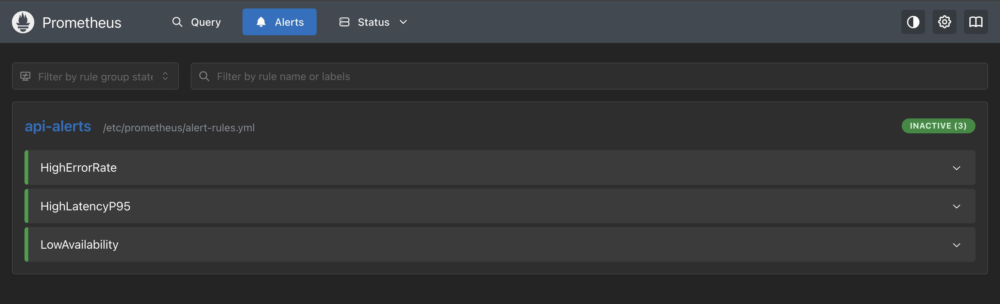
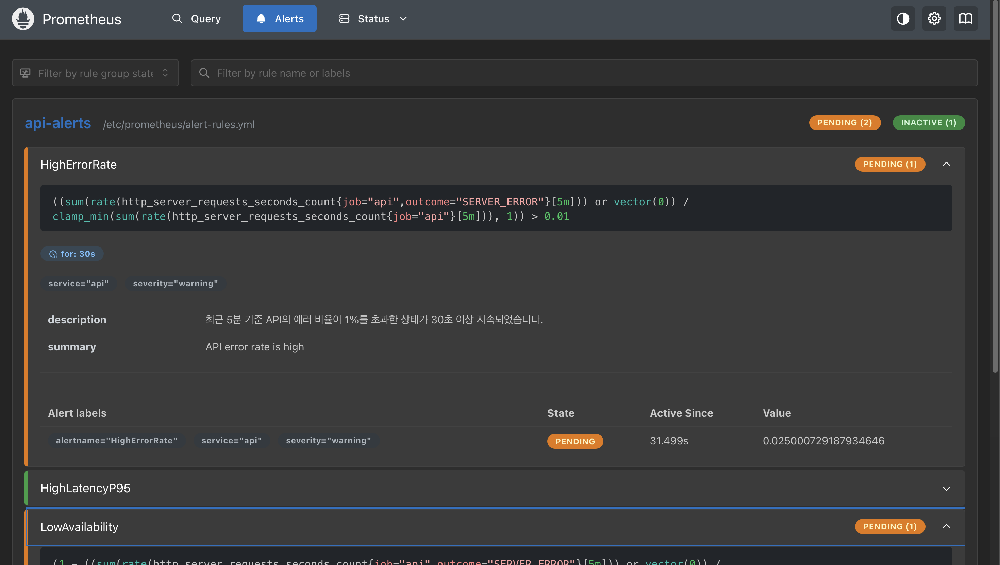
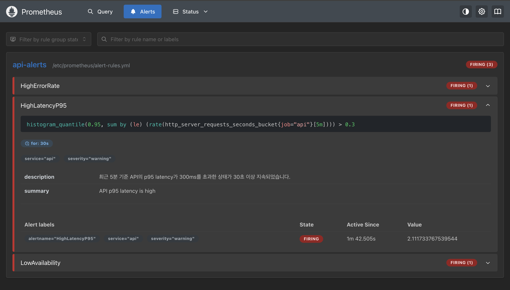

# Monitoring & Alerting System
## 프로젝트 개요
서비스의 안정성을 모니터링하고 장애를 빠르게 감지하기 위한 모니터링 및 Alert 시스템을 구축하는 것이 목표

Prometheus를 이용하여 애플리케이션의 매트릭을 수집하고, Grafana를 통해 주요 서비스 지표를 시각화

SLO 기준을 벗어날 경우 Alert가 발생하도록 Prometheus Alert Rule 설정

## 시스템 아키텍처
> Client  
> 
> → Application Server (SpringBoot)
> 
> → Prometheus (Metrics 수집)
> 
> → Grafana (DashBoard 시각화) 
> 
> → Alert Rule (장애 감지)

* Application Server 
  * 서비스 요청을 처리하며 Prometheus metric을 제공
* Prometheus
  * 애플리케이션 메트릭을 주기적으로 수집하고 Alert Rule을 통해 장애를 감지
* Grafana
  * Prometheus 데이터를 기반으로 서비스 상태를 시각적으로 확인할 수 있는 Dashboard를 제공

## SLI & SLO
### SLI
1. Error Rate
```
(sum(rate(http_server_requests_seconds_count{job=“api”, outcome=“SERVER_ERROR”}[5m])) or vector(0))
/clamp_min(sum(rate(http_server_requests_seconds_count{job=“api”}[5m])), 1)* 100
```      
2. p95 Latency
```
histogram_quantile(0.95, sum(rate(http_server_requests_seconds_bucket{job=“api”}[5m])) by (le))
```
3. Availability
```
( 1 - ( sum(rate(http_server_requests_seconds_count{job=“api”, outcome=“SERVER_ERROR”}[5m]))
or vector(0) ) / clamp_min(sum(rate(http_server_requests_seconds_count{job=“api”}[5m])), 1)) * 100
```
5. Request Rate
```
sum(rate(http_server_requests_seconds_count{job=“api”}[5m]))
sum(increase(http_server_requests_seconds_count{job=“api”}[5m]))
```
### SLO
1. Error Rate < 1%
2. p95 Latency < 300ms
3. Availabillity >=99%!

## 대시보드 & Prometheus Alert
### Grafana


### Prometheus


